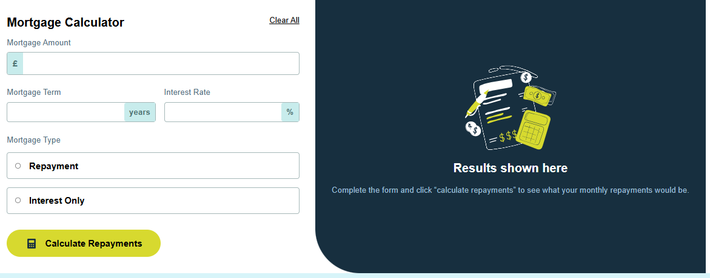

# Frontend Mentor - Mortgage repayment calculator solution

This is a solution to the [Mortgage repayment calculator challenge on Frontend Mentor](https://www.frontendmentor.io/challenges/mortgage-repayment-calculator-Galx1LXK73). Frontend Mentor challenges help you improve your coding skills by building realistic projects. 

## Table of contents

- [Overview](#overview)
  - [The challenge](#the-challenge)
  - [Screenshot](#screenshot)
  - [Links](#links)
- [My process](#my-process)
  - [Built with](#built-with)
- [Author](#author)

## Overview 🚀

### The challenge

Users should be able to:

- ✔️ Input mortgage information and see monthly repayment and total repayment amounts after submitting the form
- ✔️ See form validation messages if any field is incomplete
- ✔️ Complete the form only using their keyboard
- ✔️ View the optimal layout for the interface depending on their device's screen size

### Screenshot

### Links

- Solution URL: [Add solution URL here](https://www.frontendmentor.io/solutions/this-project-was-completely-done-with-html-js-css-IJNjkqw7yk)
- Live Site URL: [Add live site URL here](https://arm4nd7.github.io/mortage-repayment-calculator/)

## My process❓

### Built with🛠️

- Semantic HTML5 markup
- CSS custom properties
- Flexbox
- CSS Grid
- Mobile-first workflow

## Author

- Website - [Armando Estevez](https://github.com/Arm4nd7/mortage-repayment-calculator)
- Frontend Mentor - [@yourusername](https://www.frontendmentor.io/profile/Arm4nd7)

## Gratitud 🎁
* Gracias a [👀 Frontend Mentor](https://www.frontendmentor.io/) realiza challenge y proporciona ayuda a desarrollo y diseño.
